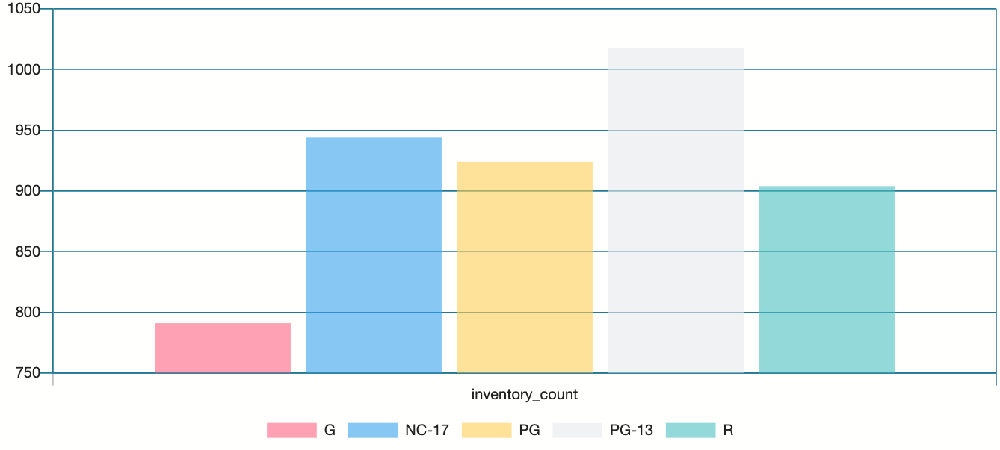
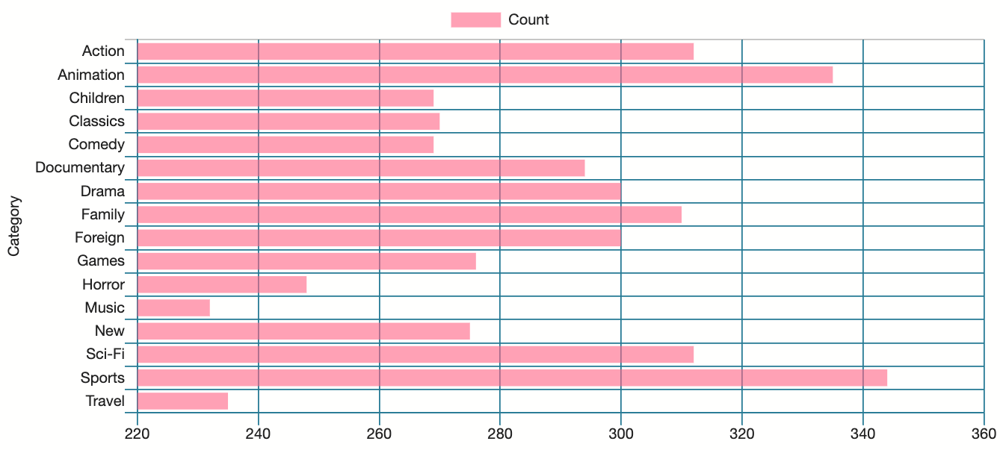
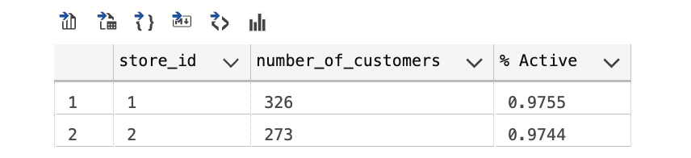

---
The Movie dataset    
---
---

###**About the Dataset**

It comprises of different categories of data with varying properties saved in different files;
_actor.csv_, _actor_award.csv_, _address.csv_, _advisor.csv_, _category.csv_, _city.csv_, _country.csv_, _customer.csv_, _customer_add.xlsx_, _customer_address.csv_, _customer_address.xlsx_, _film.csv_, _film_actor.csv_, _film_category.csv_, _film_text.csv_, _inventory.csv_, _investor.csv_, _language.csv_, _payment.csv_, _rental.csv_, _staff.csv_, _store.csv_

I create separate tables and the data in the csv files were imported into the DB.  

## The Queries 
This project was carried out for some intrinsic investigation in the dataset to answer a few questions and taking some scenarios into consideration:

1. Say investors plan to visit the stores, so they need the names of the managers in each store and the full address of the store (street, district, city, country)
*Thought*: The managers names were found in the staff table, their addressId were also in the address table which were also present in the staff table. addressID found in the address table is a foreign key in the city table. Also the cityId found in city table is a foreign key in the country table. 
Joining these tables together with their foreign keys yielded this result below
   

2. To find out the list of inventory, the film title, film rating ,rental_cost, replacement cost, and the store locations.
> To run this query we need to also create a good join almost with the previous scenario, using their foreign keys.

3. To know the how much of the inventory we have for each rating across the stores. 
> This query involves joining the inventory table with the film table using the film_id

From this graph we can see that movies rated PG-13 are quite a lot and we can also see "G" rated movies are very few in number. In the case of restocking they can put this into consideration.  

1. An investor will like to identify the potential of the inventory in terms of replacement cost, to understand how big of a hit it will be if a category of movie becomes unpopular at a certain store. Take a look at the number of films ,as well as the average replacement costs, and total replacement cost, per store and per category. 
> Here I had to join four tables to get this data, namely
> * the category, 
> * Inventory, 
> * film, 
> * and film_category tables  
From the data we can see that the top three categories with highest Average replacement cost are: Drama, classics and Action categories 
Which implies that the revenue of the company relies on the availability of these categories.

5. To find the category spread across the two stores. 

   
6. To find out about customers , and their preferred stores, plus active status and full address 
> In this scenario, we are trying to find which store do customers prefer the most, and how active the customers are in each store. C
   
